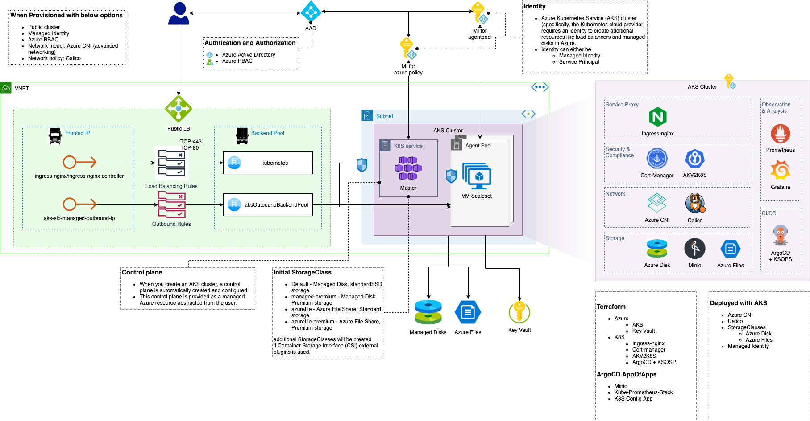

# aks-argocd-bootstrap
Bootstrapping AKS using ArgoCD

This is used by a Terraform script in [kulmam92/azure-terraform-modules/tree/main/components/StandardAKS](https://github.com/kulmam92/azure-terraform-modules/tree/main/components/StandardAKS).

## Diagram
This is what you will be getting.

